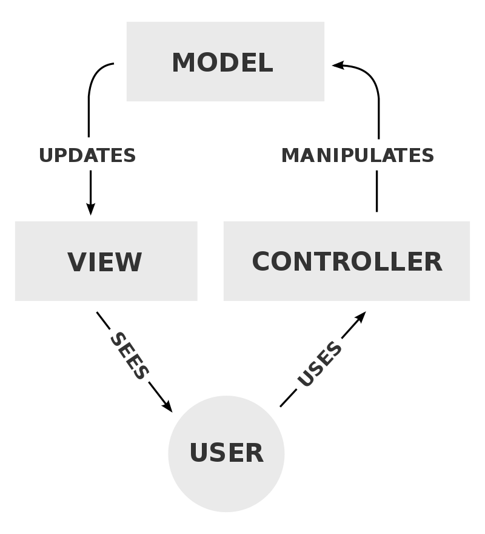
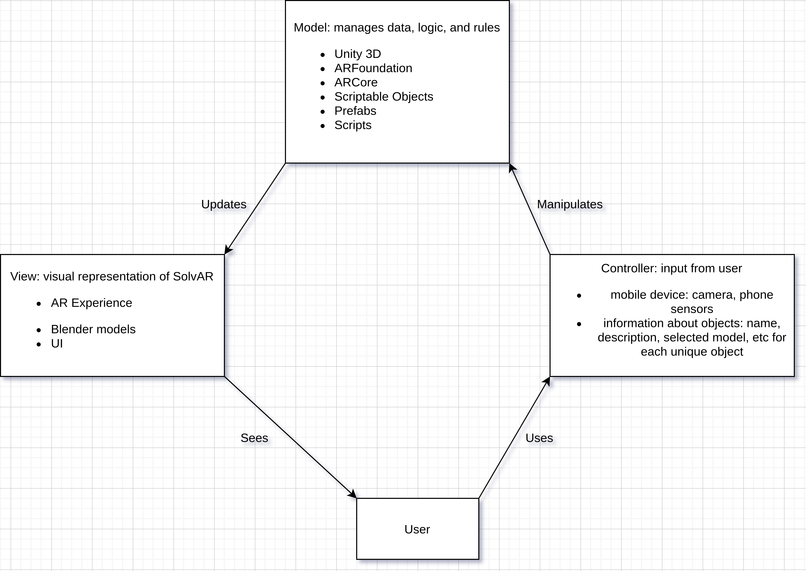

# Architecture

## Project Overview
---
Our project is an Android application that is built in Unity 3D that will display the emulated location of select objects in augmented reality. The scope of this project covers the emulation of location from a bluetooth tracker, as well as building the scene, prefabs, and scripts in Unity to design the augmented reality experience and user interface.

## Key Architectural Drivers: what reqs were essential in driving architecture decision?
---

### NF.4.1.7.

Has to interface with AR Foundation. AR Foundation is a Unity package that is the keystone of our project, so the architecture of our project has essentially been built around AR Foundation.

### NF.4.1.3.

Devices must display user chosen 3D model over the emulated location. The architecture of our project has to be able to handle mobile app design, 3D modeling, scripting, AR, and performance, so we needed an architectural model that accounts for multiple key perspectives.

## Architectural Style Choices
---

### Pipe-and-Filter Style? 

In this arch style, functionality is achieved by passing input data through filters, or components that modify data. In between these components,  pipes transmit data from one filter to the next without modifying the data. In our project, data about an emulated bluetooth tracker is passed in one direction between components, sometimes being modified, but this style doesn’t fit all of the components of our architecture.

### Model-View-Controller Style?

In this arch style, there are three key components that interact: the Model is the central component and manages the data, logic, and rules of the application; the View, the visual representation of SolvAR; and the Controller, input from the user in the mobile device that converts it into commands for the model or view. These three dynamic core components allow for a better representation of the architecture our project requires.

## Our Architecture
---

## Conclusion
---

Our chosen architectural style is the MVC model with three core components that interact with each other to create a fluid user experience: the Model, the View, and the Controller.